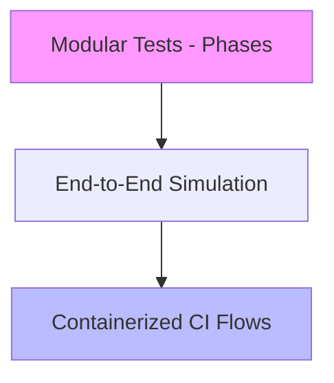
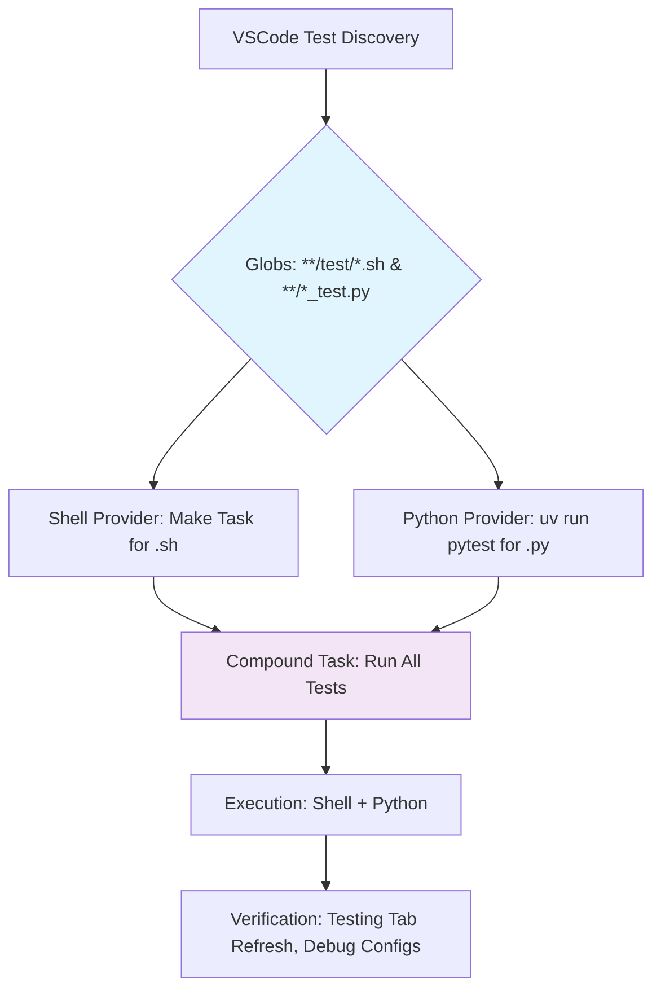

# Testing Guide

This guide outlines the testing strategy for the Duke3D Upscale project. Our tests are modular, run offline, and use isolated environments to ensure reliability and reproducibility without requiring real game assets.

## Running Tests

- Execute the full test suite through the dedicated target to validate all phases.
- Run end-to-end simulations to verify workflow orchestration.
- Use containerized flows for consistent CI validation.

## Test Categories

### Modular Shell Testing

Shell-based tests cover individual phases in isolation:
- Archive detection and extraction.
- GRP unpacking (unpack).
- Asset conversion (convert).
- Upscaling batch processing and output validation.
- Mod packaging and configuration generation.
- Engine building and launching flags.
- Cleanup operations.

Tests use fixtures for inputs, assert output existence and format, and avoid network access, writing to temporary directories.

### End-to-End Testing

Simulates the complete pipeline:
- Environment preparation.
- Sequential phase execution (extraction, unpacking, preparation, upscaling, packaging, building).
- Mod launching and basic verification.

Uses mock inputs to confirm orchestration and output integrity without dependencies on external resources.

### CI-Ready Docker Flows

Container images support:
- Dependency installation and tool checks.
- Full workflow execution in isolated environments.
- Automated validation for pull requests and releases.

Ensures cross-platform consistency and reproducibility.

## Manual Verification

- **Visuals:** Build and launch the mod to confirm visual enhancements in-game.
- **Configuration:** Inspect the generated mod files to ensure settings are applied correctly.
- **Edge Cases:** Test alternative workflows, such as selective processing or different compatibility modes.

When making changes, document the outcomes and any performance impacts.

## Adding Tests

- Focus on single behaviors using shared helpers for assertions.
- Maintain offline operation and isolation.
- Integrate into the suite for automated execution.

Refer to the [Project Plan](plan.md) for testing strategy and integration, and [Getting Started](getting-started.md) for overall workflow context.
## VSCode Testing Integration

The project supports dynamic test discovery and execution in VSCode for both shell and Python tests, using generic globs to avoid hardcoding specific files or directories. This enables easy expansion to new test locations like additional subdirs under `test/` or Python tests in `tools/`.

### Test Discovery Globs

Tests are auto-discovered using the following patterns in `.vscode/settings.json` and `.vscode/testExplorerSettings.json`:
- Shell tests: `**/test/*.sh` (covers `test/tests/` and future `test/` subdirs)
- Python tests: `**/*_test.py`, `**/test/*.py` (for pytest/unittest files in `tools/` or `test/`) 

Exclusions prevent non-test files from appearing:
- `**/node_modules/**`, `**/.venv/**`, `**/__pycache__/**`, `**/build/**`, `**/vendor/**`

Enable this by installing the [Test Explorer UI](https://marketplace.visualstudio.com/items?itemName=hbenl.vscode-test-explorer) and [Python](https://marketplace.visualstudio.com/items?itemName=ms-python.python) extensions.

### Running Mixed Shell and Python Tests

Use the Testing tab in VSCode for discovery and execution:
- **All Shell Tests**: Run via the "Test All" task (uses `make test`), which discovers and executes `**/test/*.sh` files dynamically.
- **All Python Tests**: Run via the "Test Python" task (uses `uv run pytest tools/ test/`), leveraging the uv environment for reproducible dependencies.
- **Full Hybrid Suite**: Use the "Test All Hybrid" compound task, which sequences shell and Python tests for comprehensive validation.

For individual tests:
- Shell: Select and run from the Testing tree (uses dynamic `find` for selection).
- Python: Uses pytest provider for granular execution and debugging.

Debugging:
- Shell: Use tasks for breakpoints (bashdb if installed).
- Python: Use the "Debug Python Tests" launch config, which runs pytest in the `tools/` cwd with uv environment.

### Verification

1. Open the Testing tab in VSCode (View > Testing).
2. Refresh tests (click the refresh icon) to see the expanded tree with shell (.sh) and Python (.py) nodes discovered via globs.
3. Run "Test All Hybrid" and verify output in the terminal, with problem matchers highlighting failures from both types.
4. For Python, ensure `uv` is installed (`pip install uv`) and the environment is set up (`uv sync`).

This setup ensures no hardcoded paths, supporting future test additions without config changes. The hybrid workflow is visualized below:

